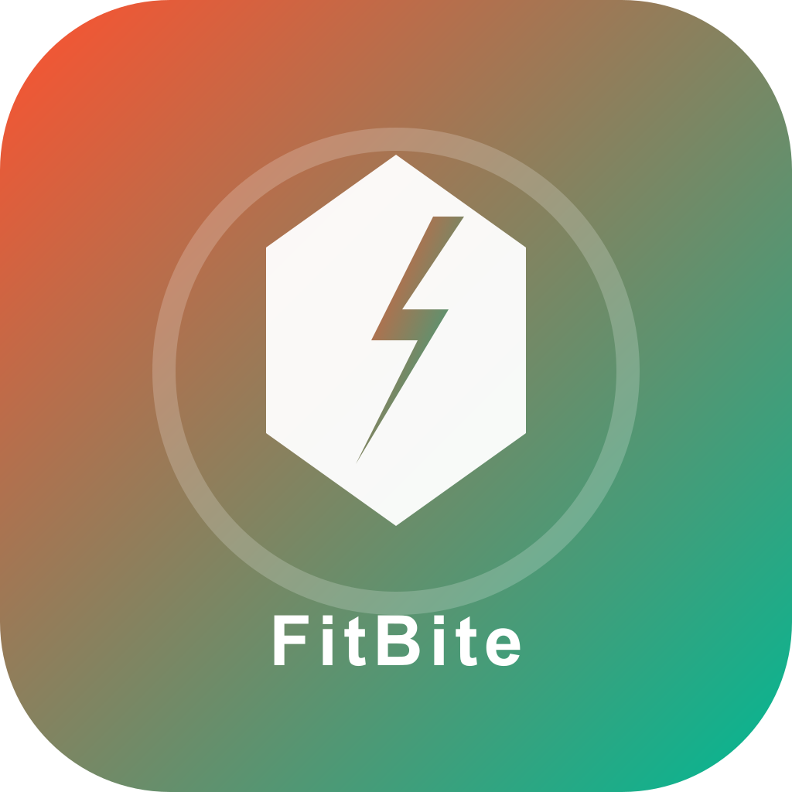

# FitBite Pal - 智能健身与饮食管理应用

<p align="center">
  
</p>

<p align="center">
  <strong>Your Personal Fitness & Food Buddy</strong><br>
  你的私人健身与饮食伙伴
</p>

## 📱 项目简介

FitBite Pal 是一款一体化健身与饮食管理移动应用，提供：
- 🏋️ **个性化训练计划** - 根据用户目标自动生成
- 🎯 **实时姿态识别** - AI 分析运动姿态并纠正
- 🍎 **智能饮食管理** - 拍照识别食物并估算热量
- 📊 **进度报表** - 体重、训练、营养数据可视化
- 🌍 **多语言支持** - 中/英文国际化

## 🛠️ 技术栈

### 前端 (FitBitePal-Mobile)
- **框架**: React Native + Expo SDK 54
- **导航**: React Navigation 7
- **状态管理**: React Context
- **国际化**: i18n-js + expo-localization
- **相机/媒体**: expo-camera, expo-image-picker

### 后端 (FitBitePal-Backend)
- **框架**: Spring Boot 3.2
- **数据库**: MySQL 8.0 + JPA/Hibernate
- **缓存**: Redis
- **认证**: JWT (JSON Web Token)
- **API 文档**: RESTful API

### AI/算法
- **姿态识别**: 关键点检测 + 角度分析
- **食物识别**: ModelScope 视觉多模态 API
- **计划推荐**: 基于用户画像的个性化算法

## 📁 项目结构

```
├── FitBitePal-Mobile/          # React Native 前端
│   ├── src/
│   │   ├── api/                # API 客户端
│   │   ├── contexts/           # 全局状态管理
│   │   ├── navigation/         # 路由导航
│   │   ├── screens/            # 页面组件
│   │   │   └── admin/          # 管理后台页面
│   │   └── utils/              # 工具函数
│   ├── services/               # 服务层
│   ├── i18n/                   # 国际化翻译
│   └── assets/                 # 静态资源
│
├── FitBitePal-Backend/         # Spring Boot 后端
│   ├── src/main/java/com/fitbitepal/backend/
│   │   ├── config/             # 配置类
│   │   ├── controller/         # REST 控制器
│   │   ├── dto/                # 数据传输对象
│   │   ├── model/              # 实体模型
│   │   ├── repository/         # 数据访问层
│   │   ├── service/            # 业务逻辑层
│   │   └── security/           # 安全配置
│   └── src/main/resources/
│       ├── static/admin/       # 网页管理后台
│       └── application.yml     # 配置文件
│
├── SRS.md                      # 需求规格说明书
├── README.md                   # 项目说明（本文件）
├── USER_MANUAL.md              # 用户使用手册
├── API_DOCUMENTATION.md        # API 接口文档
├── ARCHITECTURE.md             # 系统架构文档
├── DEPLOYMENT.md               # 部署说明
├── DOCKER_DEPLOYMENT.md        # Docker 部署指南
├── TEST_REPORT.md              # 测试报告
├── docker-compose.yml          # Docker 编排配置
└── env.docker.example          # 环境变量模板
```

## 📖 文档导航

| 文档 | 说明 |
|------|------|
| [SRS.md](SRS.md) | 需求规格说明书 |
| [USER_MANUAL.md](USER_MANUAL.md) | 用户使用手册（管理端+移动端） |
| [API_DOCUMENTATION.md](API_DOCUMENTATION.md) | REST API 接口文档 |
| [ARCHITECTURE.md](ARCHITECTURE.md) | 系统架构设计文档 |
| [DEPLOYMENT.md](DEPLOYMENT.md) | 部署说明 |
| [DOCKER_DEPLOYMENT.md](DOCKER_DEPLOYMENT.md) | Docker 部署详细指南 |
| [TEST_REPORT.md](TEST_REPORT.md) | 测试用例与测试报告 |

## 🚀 快速开始

### 环境要求
- Node.js 18+
- Java 17+
- MySQL 8.0+
- Redis 6+
- Expo CLI

### 后端启动

```bash
# 1. 进入后端目录
cd FitBitePal-Backend

# 2. 配置数据库 (修改 application.yml)
# - MySQL 连接信息
# - Redis 连接信息
# - 邮件服务配置

# 3. 启动服务
mvn spring-boot:run

# 后端将运行在 http://localhost:8080/api
# 管理后台: http://localhost:8080/api/admin/
```

### 前端启动

```bash
# 1. 进入前端目录
cd FitBitePal-Mobile

# 2. 安装依赖
npm install

# 3. 创建环境变量文件
cp .env.example .env
# 修改 EXPO_PUBLIC_API_URL 为你的后端地址

# 4. 启动开发服务器
npx expo start

# 扫描二维码或按 a 启动 Android / i 启动 iOS
```

## 📋 功能模块

### 用户模块
- [x] 注册/登录/忘记密码
- [x] JWT 认证
- [x] 用户画像 (年龄/身高/体重/目标)
- [x] 可用训练时长设置

### 训练模块
- [x] 个性化训练计划生成
- [x] 周/日训练视图
- [x] 动作详情与指导
- [x] 实时姿态识别
- [x] 训练打卡

### 饮食模块
- [x] 拍照识别食物
- [x] 热量与营养估算
- [x] 每日饮食计划
- [x] 饮食打卡记录
- [x] 手动添加食物

### 报表模块
- [x] 体重变化曲线
- [x] 训练打卡日历
- [x] 热量摄入/消耗统计
- [x] 周/月数据汇总

### 管理后台
- [x] 用户管理
- [x] 食品库管理 (双语支持)
- [x] 套餐管理 (双语支持)
- [x] 系统配置

## 🌐 国际化

应用支持中英文切换，在设置页面可切换语言：
- 🇨🇳 简体中文
- 🇺🇸 English

## 📱 兼容性

- **iOS**: 15.0+
- **Android**: 9.0+ (API 28+)
- **平板**: 支持

## 🔧 配置说明

### 后端配置 (application.yml)

| 配置项 | 说明 | 默认值 |
|--------|------|--------|
| `spring.datasource.url` | MySQL 连接地址 | localhost:3306 |
| `spring.data.redis.host` | Redis 地址 | localhost |
| `jwt.secret` | JWT 密钥 | 需修改 |
| `jwt.expiration` | Token 有效期 | 24小时 |
| `modelscope.api.key` | AI API 密钥 | 需配置 |

### 前端配置 (.env)

| 配置项 | 说明 | 示例 |
|--------|------|------|
| `EXPO_PUBLIC_API_URL` | 后端 API 地址 | http://192.168.x.x:8080/api |

## 📦 构建发布

### Android APK
```bash
cd FitBitePal-Mobile
eas build -p android --profile preview
```

### iOS IPA
```bash
cd FitBitePal-Mobile
eas build -p ios --profile preview
```

## 🔐 安全说明

- 所有 API 使用 HTTPS 传输
- 密码使用 BCrypt 加密存储
- JWT Token 有效期 24 小时
- 敏感信息配置使用环境变量

## 📄 API 文档

后端 API 端点列表请参考：
- 认证: `/api/auth/*`
- 用户: `/api/user/*`
- 训练: `/api/training/*`
- 饮食: `/api/diet/*`
- 报表: `/api/reports/*`
- 管理: `/api/admin/*`

## 👥 贡献指南

1. Fork 本仓库
2. 创建功能分支 (`git checkout -b feature/AmazingFeature`)
3. 提交更改 (`git commit -m 'Add some AmazingFeature'`)
4. 推送到分支 (`git push origin feature/AmazingFeature`)
5. 创建 Pull Request

## 📝 许可证

本项目仅供学习交流使用。

---

<p align="center">Made with ❤️ by FitBite Pal Team</p>

